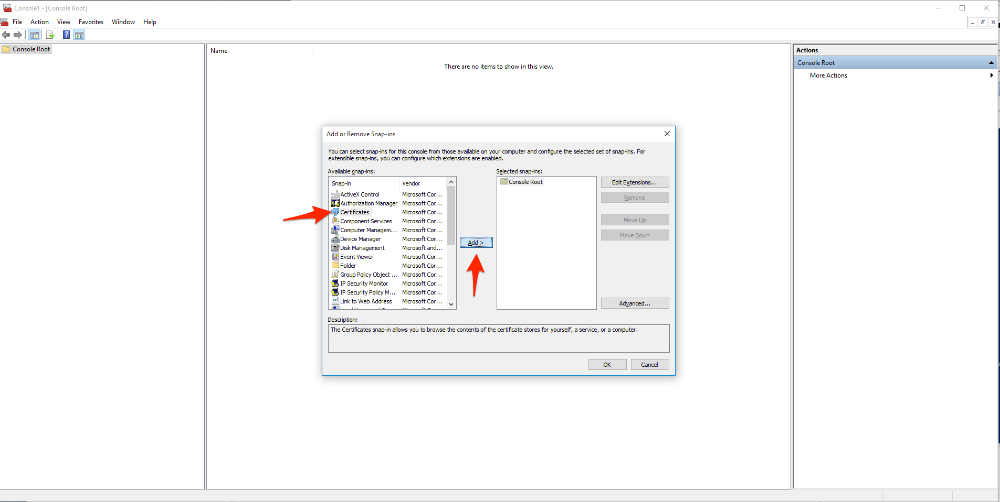
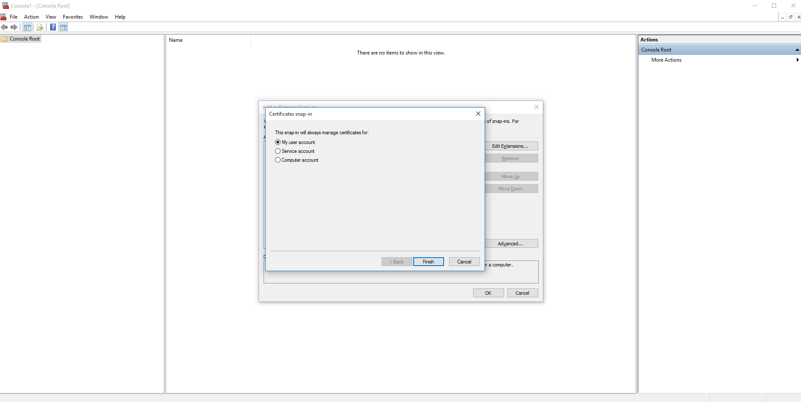
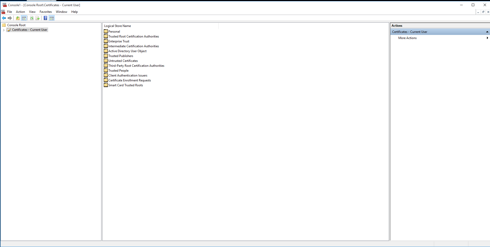
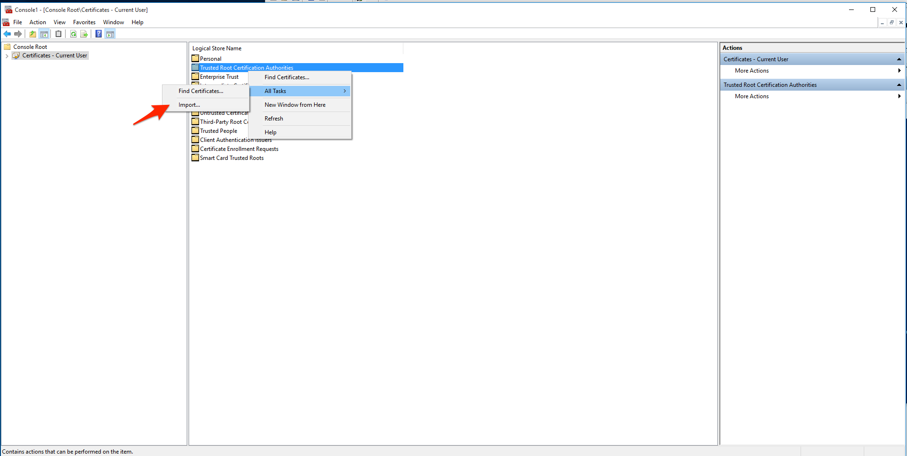
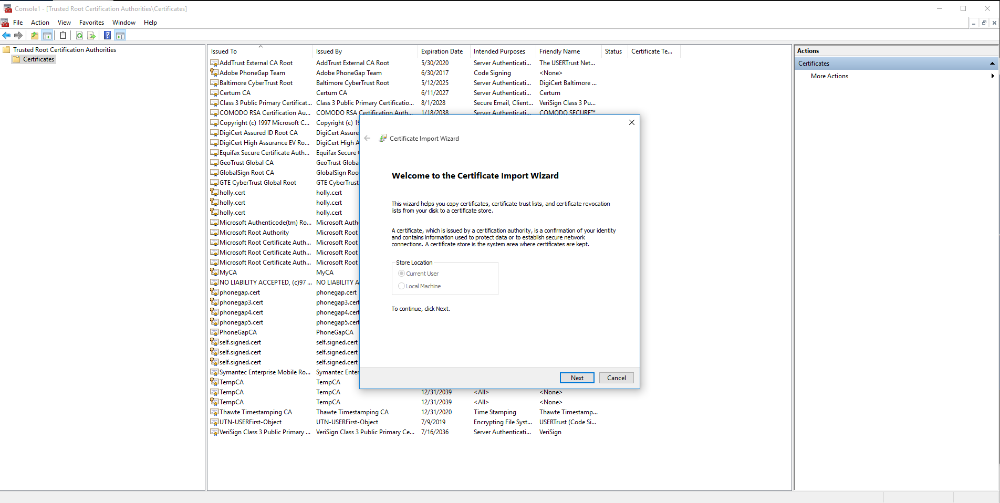
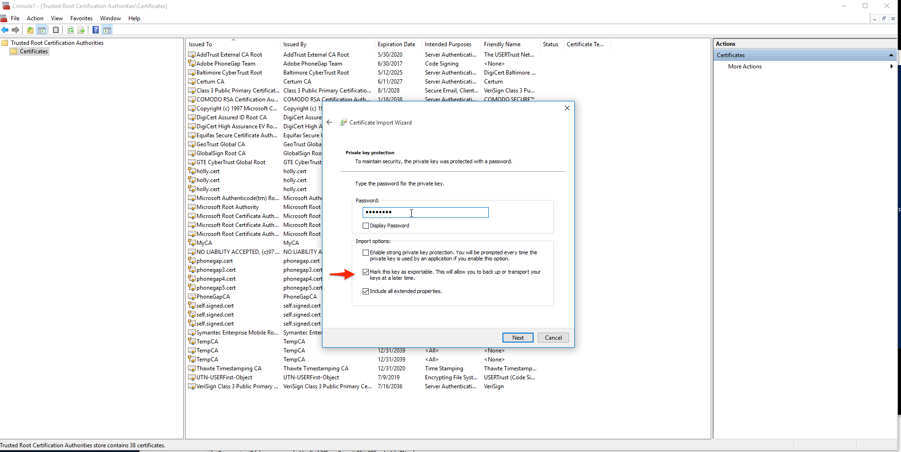
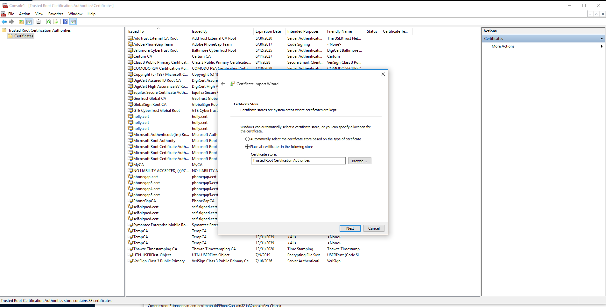
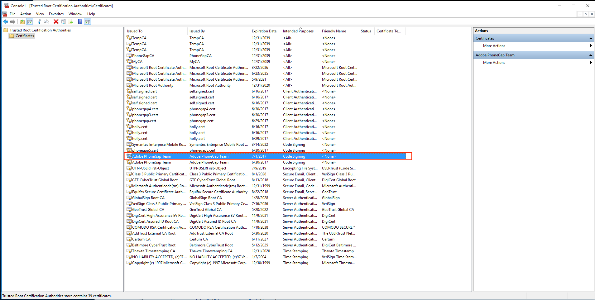
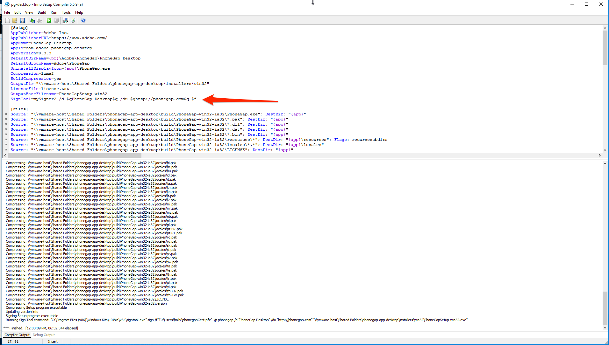

# Windows Code Signing 

This document covers the process to code sign the PhoneGap Desktop app for Windows 10 on Windows 8.1. 

## <u>Windows 10 Code Signing</u>

* If you’re using vmware, map a shared folder to the phonegap-app-desktop folder on Mac

* Set your `path` variable to ensure you can use the `signtool` tools from the command line for testing: 

1. Right click on start menu icon and choose *System*

2. In the left menu, choose *Advanced system settings*

3. Click the *Environment Variables* button

4. In the System variables - highlight the `path` variable and add the following

	`;C:\Program Files (x86)\Windows Kits\10\bin\x64`

    **Note:** Ensure it’s preceded by a semicolon(;) to separate it from the previous path

* Open the **Windows Powershell** program (locate it in the Applications list or via search)

* Use the following command to create a new self signed certificate:

    `New-SelfSignedCertificate -DnsName "phonegap.cert" -CertStoreLocation Cert:\CurrentUser\My -KeySpec "KeyExchange" -KeyUsage "CertSign" -Type  "CodeSigningCert" -Subject "Adobe PhoneGap Team"`
    
	**Output**

        Directory: Microsoft.PowerShell.Security	\Certificate::CurrentUser\My
           
        Thumbprint                                Subject
        ----------                                -------
    	  FFAE62AE14CBB14F6B8C830428232D32064BF9FD  CN=phonegap.cert
    

      **Reference:** [https://technet.microsoft.com/library/hh848633](https://technet.microsoft.com/library/hh848633)

* Create a variable to store the certificate password

        $CertPwd = ConvertTo-SecureString -String "phonegap" -Force –AsPlainText

* Export it to a .**pfx** certificate (required for signing) with the password variable created above and the thumbprint shown in the output

	`Export-PfxCertificate -cert cert:\CurrentUser\my\FFAE62AE14CBB14F6B8C830428232D32064BF9FD -FilePath phonegap.pfx -Password $CertPwd`

	**Output**

        Directory: C:\Users\myUser
    
        Mode                LastWriteTime         Length Name
        ----                -------------         ------ ----
        -a                 6/30/2016   2:51 PM      2573 phonegap.pfx

* Next you need to import it into your *Trusted Root Certification Authorities* store in Windows before you can use it to sign the app using the **Microsoft Management Console**. It can be run from the Powershell by typing `mmc`. The whole workflow described above is shown below for reference:

* Once the Management Console opens, go to **File -> Add/Remove Snap-In…**

* Click on **Certificates** then click the **Add >** button 

* In the pop-up choose **Current User** and hit Finish**

* You will see the Certificates Snap-in showing under the Console. Click on it to reveal a new list of items on the right as shown below:

* Right click on **Trusted Root Certification Authorities** then choose **All Tasks -> Import...**

* In the pop-up dialog, keep the **Current User** selection for Store Location and press Next

* Locate your **.pfx** from the file system (you’ll need to change the default **.cer/.crt** file type drop-down to reveal the **Personal Information Exchange** files it in your file explorer) and click **Open**. 

* Click **Next** and you will be prompted to enter the password you used when you created it. Also click the checkbox to make it exportable for future use.

* Ensure you are putting it in the **Trusted Root Certification Authorities** store as shown below and then click Finish in the final dialog:

* You will receive a Security Warning dialog, just click *Yes*

* Once complete, double check to ensure that it has the **Intended Purpose** field set to **Code Signing** 

* You could now test it out by manually signing an **.exe** using the following command, otherwise move on to the next section to configure [Inno Setup](http://www.jrsoftware.org/) to use the newly created certificate. 

	**Note:** this will require you to have `signtool` installed which is part of the Windows SDK. 

    ` signtool sign /f "phonegap.pfx" /p phonegap "Z:\phonegap-app-desktop\installers\win32\PhoneGapSetup-win32.exe"
`

	**Output**

    	Done Adding Additional Store
    
    	Successfully signed: Z:\phonegap-app-desktop\installers\win32\PhoneGapSetup-win32.exe
	
## <u>Configure Inno Setup for Code Signing</u>

Now you need to configure Inno Setup for code signing using your **mypfx.pfx** file created above. You will need to configure the command with a new singing tool setting and then use that setting in the **pg-desktop.iss** script.

**Note:** this will require you to have `signtool` installed which is part of the Windows SDK.
 

* Select **Tools -> Configure Sign Tools** 

* Click the **Add** button and enter a name for your signing setting (ie: **mySigner**)

* Enter the following in the **Command for the Signing Tool** and modify the parameters to match the location of your *.pfx*:

    	"C:\Program Files (x86)\Windows Kits\10\bin\x64\signtool.exe" sign /f "C:\Users\holly\phonegap.pfx"  /p phonegap $p

* Now edit the **pg-desktop.iss** file to use the **mySigner** command in the `[Setup]` section with the following line: 

	`SignTool=mySigner /d $qPhoneGap Desktop$q /du $qhttp://phonegap.com$q $f`

## <u>Windows 8.1 Code Signing</u>

* Map a shared folder in vmware to the phonegap-app-desktop folder on Mac

* You may or may not need to do the following 

    1. Set environment variables to ensure you can use the `makecert` and `signtool` tools

* Right click on start menu icon and choose *System*

* In left menu, choose *Advanced system settings*

* Click the *Environment Variables* button

* In the System variables - highlight the `path` variable and add the following

    `;C:\Program Files (x86)\Windows Kits\***_8.1_***\bin\u0064*`

    *Ensure it’s preceded by a semicolon(;) from the previous path*

* Open a command prompt 

* Create a certificate with `makecert` tool in Windows

	`makecert -n "CN=PhoneGapCA" -r -sv PhoneGapCA.pvk PhoneGapCA.cer`

	Follow the dialog pop-ups and enter your desired password (*phonegap* is the default for this example)

* Now officially sign using a trusted cert

    `makecert -sk SignedByCA -iv PhoneGapCA.pvk -n "CN=SignedByCA" -ic PhoneGapCA.cer SignedByCA.cer -sr currentuser -ss My`

     Follow the dialog pop-ups and enter the password from previous step (*phonegap*)

* Double click the **PhoneGapCA.cer** and follow the prompts to ensure it’s trusted. Use the same password from the create. **	

* Create the pfx with:

	`pvk2pfx.exe ^ -pvk PhoneGapCA.pvk ^ -spc PhoneGapCA.cer ^ -pfx PhoneGapCA.pfx ^ -po phonegap`
	

**Official Certificate**

The above is using a self-signed certificate. In the future we need to purchase one via an official code signing authority. 
